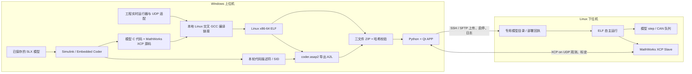
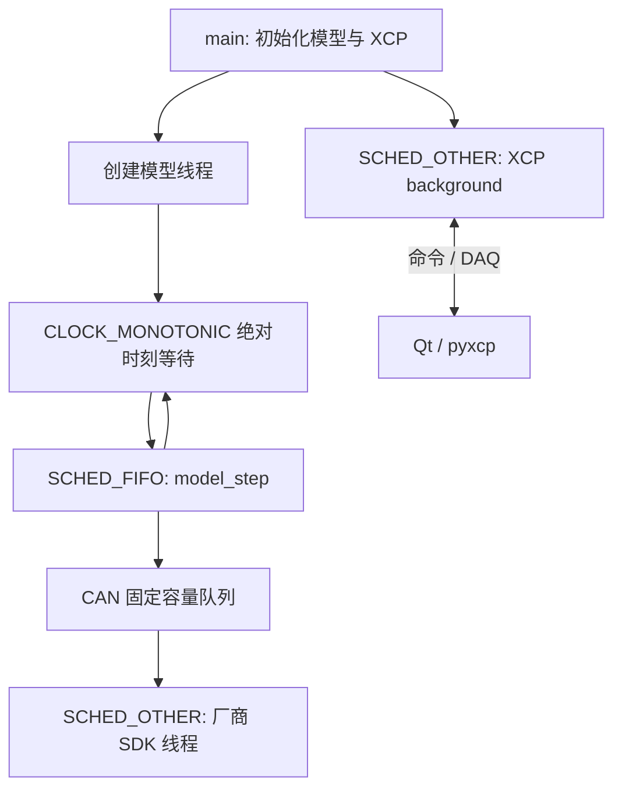

# 技术路线与源码阅读指南

本文描述当前工程的实现，适用于 MATLAB/Simulink R2024b、Windows x64 上位机及 Linux x86-64 下位机。新机器安装步骤见 [新机部署指南](NEW_MACHINE_DEPLOYMENT.md)，故障定位见 [故障排查](TROUBLESHOOTING.md)。源码路径均相对于工程根目录。

## 1. 整体分工

核心路线是：**Windows 本地生成模型 C 代码，本地交叉编译为 Linux ELF，本地根据最终 ELF 导出 A2L，打包 ZIP；Qt APP 经 SSH/SFTP 部署，Linux 自主执行模型，APP 经 XCP 观测与标定。**



三条链路的边界如下：

| 链路 | 谁执行 | 输入与结果 | 是否需要下位机在线 |
| --- | --- | --- | --- |
| 代码生成及链接 | Windows MATLAB 与交叉编译器 | SLX → C → Linux ELF | 不需要 |
| A2L 与部署包 | Windows MATLAB | 本轮生成元数据及最终 ELF → A2L、JSON、ZIP | 不需要 |
| 文件部署及进程管理 | Qt、Paramiko、Linux Python 3 | 上传、哈希检查、启动、停止、查询、删除、自启 | 需要 SSH |
| 测量与标定 | Qt、pyxcp、模型内 XCP Slave | 按 A2L 地址读写、DAQ 上传 | 需要 XCP 网络 |

Linux 无需安装 MATLAB、Simulink 或编译器。SSH 登录成功只能证明管理链路可达；XCP 使用自己的套接字，仍需模型已启动且对应端口可达。APP 下线不会让模型停止步进；“停止模型”是独立的进程操作。

## 2. 两套编译器各自编译什么

| 工具 | 入口 | 生成物 | 运行位置 |
| --- | --- | --- | --- |
| Linux 交叉 GCC 与 sysroot | `x280_linux_target/x280PortableToolchain.m`，`portable-linux-toolchain/portable-linux-toolchain/` | `<model>.elf` | Linux x86-64 |
| Windows LLVM-MinGW C++ 编译器 | `qt_xcp_host/build_native.ps1`，`tools/qt_toolchain/` | `qt_xcp_host/qt_host/native_bin/xcp_core.dll` | Windows x64 |
| PyInstaller | `qt_xcp_host/build.ps1` | `QtXCPHost.exe` 与 `_internal/` | Windows x64 |

Windows DLL 负责曲线缓存、统计、游标、显示抽样；它没有模型算法，也不调度 Linux 模型。Linux GCC 不能用来替代 Windows DLL 的编译器。PyInstaller 收集 Python/Qt 依赖，不负责模型 C 代码生成或 Linux 链接。

`qt_xcp_host/pyxcp_host/` 是同一 Qt APP 的通信服务层，不是第二套 APP。正式启动入口为 `Demo_XCP_Qt/START_DEMO.cmd`；开发运行入口为 `qt_xcp_host/run.ps1`。

## 3. 从 Ctrl+B 到唯一 ZIP

### 3.1 注册、配置与生成钩子

1. `setupX280LinuxTarget.m` 检查 R2024b 及必要产品，注册 `SimRT` 硬件，重建当前路径对应的工具链注册文件。移动工程或从旧注册名称升级后需要重新注册。默认 `Persist=false`，不会把会话配置强制写入永久 MATLAB path。
2. `configureX280Model.m` 配置 `ert.tlc`、C、Linux x86-64、固定步长、单任务、外部模式、可调参数和本地工具链。当前交付主模型为 `x280_rt_single`，基本步长为 `0.001` 秒；CAN 验证模型同样使用 1 ms。
3. `slbuild` / Ctrl+B 运行 Embedded Coder。`+codertarget/+x280linuxssh/+internal/onAfterCodeGen.m` 接收 `buildInfo`，补齐 XCP 适配、UDP 初始化参数及实时运行器。
4. `addRealtimeRuntime.m` 保留生成的模型算法，移除编译列表中的 `ert_main.c` 和官方 `linuxinitialize.c`，加入工程的 `x280_rt_main.c` 与 `x280_rt_runtime.c`。原始入口另存到构建证据中，便于比较。
5. `LocalBuildHook.after_make` 仅在实际链接完成后调用 `completeLocalBuild.m`。`GenCodeOnly=on` 时不会发布最终部署包。

底层校验器与运行器仍能识别 1/10/100 ms 的既有接口，这不表示当前交付又包含多套不同周期模型；当前使用与验收基线为 1 ms。运行器要求单任务 C 代码，拒绝独立异步任务及并发任务配置。

`SimRT` 是 Simulink 中的硬件显示名称。`x280_linux_target/`、`x280linux`、`x280linuxssh`、`setupX280LinuxTarget` 以及模型文件名是现有源码接口，继续保留；`X280 portable-linux-toolchain` 是独立的编译工具链名称。文档中用于描述实际 ThinkPad X280、主机名或历史日志的 X280 也不表示另一个注册目标。

### 3.2 编译与地址稳定性

`x280PortableToolchain.m` 将 `linux-gcc.exe`、GNU Make、binutils 及 sysroot 接入 MATLAB 工具链。当前编译参数包括 `-O2 -g -gdwarf-4 -fno-pie`，链接参数包括 `-no-pie -pthread` 和 `--wrap=sem_wait/sem_post`。

非 PIE 使 ELF 保持固定虚拟地址；A2L 的地址来自本轮最终链接 ELF。APP 的 `model_payload.validate_payload` 要求 ELF64、little-endian、x86-64、`ET_EXEC`。随意改成 PIE、剥离必要符号后再导出、把旧 A2L 配给新 ELF，都可能破坏按地址访问的前提。应重新生成配套三文件，而不是在 APP 中猜偏移。

### 3.3 发布与证据目录

成功输出形式为：

```text
<model>_local/
    <UTC时间戳>.zip
        <UTC时间戳>/
            <model>.elf
            <model>.a2l
            <model>.xcp-manifest.json
```

`completeLocalBuild.m` 先在内部 `pending_payload` 导出，再检查恰好三文件、收集源码及工具链证据，最后调用 `packageX280Artifacts.m`。ZIP 校验成功后删除展开的时间戳目录，并删除模型目录最外层重复 ELF。不要把 `_ert_rtw` 当作部署目录上传。

内部诊断位置：

| 路径 | 内容 |
| --- | --- |
| `<model>_ert_rtw/x280_local_build.json` | 最新构建回执，含 `archive`、ZIP SHA-256、ELF SHA-256、证据路径 |
| `<model>_ert_rtw/x280_build_evidence/<时间戳>/build_report.json` | 该轮模型、编译器、产物身份及本地构建结果 |
| 同目录 `elf_inspection.txt` | ELF 头、动态依赖与符号版本信息 |
| 同目录 `<model>_rt_bundle/` | 可检查的生成源码和实时入口，含保留的原始入口 |
| 同目录 SLX、Makefile、批处理文件 | 当轮模型快照与链接过程依据 |
| 同目录 `deployment_cache/` | 从校验通过 ZIP 解出的内部配套文件，用于后续定位 |

`buildX280Local.m` 是程序化完整构建入口；`locateX280ELF.m` 根据回执及哈希找回配套 ELF。`generateX280RealtimeBundle.m` 与 `tools/build_local_bundles.py` 是分阶段诊断入口。标准路径不调用 Linux 目标机上的编译器。

## 4. XCP 通信文件与 A2L 的来源

### 4.1 XCP 协议栈

外部模式开启后，MathWorks 的代码生成流程把 XCP Slave 及传输层源码加入构建。工程使用 MATLAB 安装目录中 `toolbox/coder/xcp/src/target/` 下的实现；`onAfterCodeGen.m` 显式补入其中 `ext_mode/src/xcp_ext_mode.c`，并使用官方 Ethernet 帧格式与 rtIOStream 驱动。

工程自己提供的 `src/xcp_ext_param_x280_udp.c` 替换官方 TCP 默认初始化参数，默认 `UDP`、端口 `17725`、非阻塞服务器模式。硬件注册中的 “XCP on TCP/IP” 标签用于接入共享协议栈，不代表最终产物使用 TCP。协议和端口以实际生成 A2L/JSON 及运行器为准。

`x280XCPConfiguration.m` 的 DTO 上限为 508 字节，加上 4 字节 XCP Ethernet 头后为 512 字节，匹配当前 pyxcp UDP 接收边界。生成钩子同步编译定义及 `xcp/server_config.json`，A2L 改写也使用同一配置。只改一个位置会产生双方理解不一致。

### 4.2 A2L 是描述文件，不执行通信

`exportX280A2L.m` 调用 Embedded Coder 的 `coder.asap2.getEcuDescriptions` 和 `coder.asap2.export`，将最终 ELF 作为 `MapFile`。它负责把模型对象、类型、地址、标定及测量属性导出；`rewriteX280A2LForUDP.m` 同步目标传输信息。

A2L 描述“某个变量在哪里、是什么类型、怎样换算、在哪个模型事件采样”。当前 APP 读取其中可直接访问的基础标量、地址、字节序和事件，按原始类型解码；没有实现完整 ASAP2 `COMPU_METHOD` 物理量换算、曲线或 MAP 标定。学习或扩展时要区分标准文件能表达的内容与当前 APP 已支持的范围。

ELF 中的 XCP Slave 才负责在运行时访问这些地址。JSON 是部署清单，保存模型名、MATLAB 版本、目标地址、传输协议、端口、文件名、长度及 ELF/A2L 的 SHA-256；它不代替 A2L 变量描述。

清单哈希用于发现损坏或错误配对，不是发布者数字签名。修改 A2L 地址或目标信息后，仅手工重算清单不能证明它与 ELF 的语义匹配；应使用本轮生成元数据和 ELF 重新导出。

### 4.3 模型层级的来源

`createX280ASAP2Hierarchy.m` 从 `coder.getCodeDescriptor` 读取数据接口，用 `Implementation.getExpression()` 匹配 A2L 对象，用 Simulink SID 找原始块的父链，再通过 `coder.asap2.Group` 写入标准 `GROUP/SUB_GROUP`。

分组显示名保存原模型/子系统名，稳定内部组 ID 为 `X280_ModelHierarchy_...`。共享参数或多个使用点按公共父级归属；工作区数据及无法对应到更深来源的对象归入模型根级。编译优化可能让某些信号不再有可访问存储，此时它们不能仅靠补树节点成为可观测变量。

APP 通过 `services/a2l_metadata.py` 解析真实分组及通信声明，`ScalarView.model_path` 传递路径，`qt_host/catalog_tree.py` 显示观测/标定树。不会通过拆分 C 名称中的下划线或点号推测模型层级。当前目录主要支持可直接访问的基础标量；数组完整采集需要对应的脚本或后续明确扩展。

## 5. Linux 1 ms 自主运行

`src/x280_rt_main.c.in` 将模型名、周期、采样时间数量替换为本轮配置，形成真正参与链接的入口。模型初始化后立即进入自主调度，不等待 APP 上线；`-w` 等待主站启动的方式被明确拒绝。



`x280_rt_runtime.c` 用链接器的 `sem_wait/sem_post` 包装点接入调度：

- `CLOCK_MONOTONIC + clock_nanosleep(TIMER_ABSTIME)` 等待绝对释放时刻，减少相对等待累积漂移。
- 默认要求 `/sys/kernel/realtime == 1`，模型线程 `SCHED_FIFO` 优先级 40；可设置范围为 1..49。
- `X280_RT_CPU` 指定允许亲和性集合内的 CPU，未设置时选择允许集合中编号最大的 CPU。
- 为模型线程预分配、预触碰栈并 `mlockall`；权限或额度不足直接报错。
- 一步超时后跳到将来的释放时刻，累计 `skipped_releases`，不会补跑一串积压周期。
- 主线程处理 XCP 后台工作，保持 `SCHED_OTHER`。模型内生成的 DAQ 上传仍计入 `model_step` 测量范围。

需要区分四种时间：

| 时间 | 数据来源 | 能说明什么 |
| --- | --- | --- |
| 名义 1 ms 基本步长 | SLX `FixedStep=0.001` | 模型设计周期 |
| 实际 `model_step` 间隔及耗时 | Linux `CLOCK_MONOTONIC`，`x280_rt_summary` | 模型实际执行与抖动 |
| DAQ 事件时间及接收间隙 | Slave 时间戳、传输计数、APP 诊断 | 采样/传输完整性 |
| 界面刷新间隔 | Qt 定时器与绘图 | 显示流畅程度 |

在退出并回收模型线程时打印的 `x280_rt_summary` 是运行证据。`model_step_interval_*`、`model_step_execution_*`、`deadline_misses`、`skipped_releases` 应一起看；图上看起来等间隔并不能证明实际模型无超期。实时内核及 FIFO 配置也不能单独证明任意负载下的最坏时延。

## 6. Qt APP 的状态与数据流

### 6.1 控制层与线程

`main.py` 创建 QApplication 和 `qt_host/window.py::MainWindow`。`controller.py` 负责加载、上线、观测、标定、下线与关闭；`state.py` 定义 `EMPTY → LOADED → CONNECTING → CONNECTED → ACQUIRING` 等状态及按钮策略。

XCP 控制命令交给单工作线程的 `ThreadPoolExecutor`，结果通过队列送回 Qt 主线程。`pyxcp_host/viewmodel.py` 隔离界面与服务，`services/xcp_session.py` 用 `RLock` 串行化读写、DAQ 控制及恢复。

继续向下阅读时，`services/backend.py` 是导入适配层。真正的基础 A2L 解析及 pyxcp 封装位于 `x280_linux_target/python/x280_xcp/a2l.py`、`client.py`：前者提供 `A2LScalar` 字节编解码，后者创建 `pyxcp.master.Master` 并执行内存读写。打包 APP 时会收集这一共享模块；只复制 Qt Python 文件而遗漏它，会导致源码运行或打包导入失败。

SSH 页面 `qt_host/target.py` 使用独立 `AsyncWorker` 和完成信号，资源轮询与模型清单刷新分开。模型清单在连接、手动刷新及部署/删除等必要事件后更新；日常资源轮询不反复重建列表，保护当前选择和右键操作。后台线程不能直接修改 QWidget。

### 6.2 加载及自动连接参数

`PayloadArchive.load` 在 `%TEMP%/qt-xcp-payload-*` 私有目录解压 ZIP，检查路径、文件数量、大小、文件类型及清单，再自动加载 A2L；APP 关闭时清理其拥有的缓存。线上状态禁止切换配套文件，以免当前会话使用了不同地址表。

观测页只提供“加载模型 / 上线 / 下线”命令。`HostController._resolve_file_endpoint` 的决策为：

1. ZIP 使用清单指定的协议/端口；A2L 若也有声明，必须一致。
2. 单独 A2L 只声明一种协议时直接采用；同时声明多种协议而没有配套 ZIP 时拒绝猜选。
3. 主机地址优先采用 ZIP 清单，其次相应 A2L ADDRESS，最后才使用实时机页 SSH 主机。
4. 协议、端口或最终地址缺失时禁用上线，并显示原因。

因此把 SSH 主机改成另一台机器，不会覆盖 ZIP 中已有的 `TargetAddress`。迁移目标地址应重新导出匹配文件；加载单独 A2L 且其未声明地址时，才使用 SSH 主机回退。

### 6.3 DAQ、缓存、显示与游标

`services/daq_acquisition.py` 通过 pyxcp 配置模型事件 DAQ，验证 DTO 长度与 ID，处理计数跳变、时间戳回绕、不完整事件和有界队列。诊断包含 `transport_counter_gaps`、`timestamp_gap_samples`、`queue_dropped_samples` 等独立计数。

`qt_host/native.py` 通过 C ABI 调用 `native/xcp_core.cpp`。APP 默认每信号保留 1,000,000 个原始点；底层库默认容量与 APP 默认值不同，以 APP 的配置为准。满容量淘汰最旧点，内存按实际数据量增长。

绘图从可见原始数据产生有上限的 min/max 包络；CSV 导出当前保留的完整原始缓存。单/双游标使用原始数据插值，不依据显示抽样点；超出缓存范围不外推。只有“勾选 + 曲线可见 + 已有数据”的信号参与游标结果。取消勾选不删除历史缓存，重新勾选可以继续查看保留的数据。

### 6.4 标定恢复与进程管理

`XcpSession.write_calibrations` 在首次修改每个对象前保存原始字节，写后回读验证，并拒绝同会话内重叠地址对象。写入失败尝试恢复本批修改；下线、关闭及停止远程模型前也会尝试恢复。

恢复失败会保留待恢复状态并阻止操作直接成功，避免把“按钮点过”视为“目标已恢复”。原始字节仅保留在当前 APP 会话内，崩溃、强制结束、目标重启都需要单独核对；APP 不保证断电后还能自动恢复旧会话。

`services/ssh_deployment.py` 在远端先写 `.pyxcp-payload.pending`，上传后校验再发布 `.pyxcp-payload.json`；启动时复核文件。进程记录包含 PID、启动时间、ELF 路径及用户，用于避免把复用 PID 当作本 APP 的模型。自启由 `model_autostart.py` 管理一个用户级 `pyxcp-host-model.service`；删除由 `model_deletion.py` 检查专用目录、停止状态、其他 ELF 与符号链接后进行。

## 7. CAN 驱动的分层

```text
Vehicle Network Toolbox: CAN Pack / CAN Unpack、CAN FD Pack / CAN FD Unpack
    ↓ 官方 CAN_MESSAGE_BUS / CAN_FD_MESSAGE_BUS
MATLAB System: CANSetup、CanSent、CanReceive
    ↓ coder.ExternalDependency + coder.ceval
x280_tc1013_can.c: 参数校验、共享设备、固定队列、后台线程
    ↓ dlopen / dlsym
厂商 Linux SDK: libTSCANApiOnLinux.so、libTSH.so
    ↓ USB / TC1013
CAN1 / CAN2
```

源码入口为 `x280_linux_target/+x280linux/+can/` 和 `drivers/tc1013/src/`。`Native.updateBuildInfo` 将 C 适配层加入模型链接，厂商 `.so` 通过 `CANSetup.DriverDirectory` 在目标机运行时加载，不进入三文件 ZIP，必须单独安装。

仿真中的 `HostTransport='Loopback'` 是 MATLAB 软件队列；生成的 Linux 代码调用真实设备接口。两者应分别测试，软件回环通过不能证明接线、USB 权限和硬件收发已经正确。

模型步进线程只做固定容量队列及 trylock 操作，厂商 SDK 位于 SCHED_OTHER 后台线程。`CanSent.Status=0` 表示发送请求入队，不能证明对端接收。`CanReceive` 每步最多取一帧，仅在 `Valid=true` 且 `Status=0` 时解释为本步新报文；同时应检查 ID。队列忙、溢出、SDK 错误须由模型处理。

协议、通道、波特率及 `DriverDirectory` 是编译配置，变更后重新构建。具体接口、状态码和硬件验证边界见 [TC1013 驱动说明](../x280_linux_target/drivers/tc1013/README.md)。

## 8. 建议源码阅读顺序

| 顺序 | 文件 | 阅读时回答的问题 |
| --- | --- | --- |
| 1 | [configureX280Model.m](../x280_linux_target/configureX280Model.m)、[validateX280RealtimeModel.m](../x280_linux_target/validateX280RealtimeModel.m) | 模型必须满足哪些生成约束？ |
| 2 | [onAfterCodeGen.m](../x280_linux_target/+codertarget/+x280linuxssh/+internal/onAfterCodeGen.m)、[addRealtimeRuntime.m](../x280_linux_target/+codertarget/+x280linuxssh/+internal/addRealtimeRuntime.m) | 哪些文件由 MathWorks 提供，哪些由工程替换？ |
| 3 | [x280PortableToolchain.m](../x280_linux_target/x280PortableToolchain.m)、[completeLocalBuild.m](../x280_linux_target/+codertarget/+x280linuxssh/+internal/completeLocalBuild.m) | 如何本地链接、发布并保留证据？ |
| 4 | [exportX280A2L.m](../x280_linux_target/exportX280A2L.m)、[createX280ASAP2Hierarchy.m](../x280_linux_target/createX280ASAP2Hierarchy.m) | 地址、变量与模型层级如何建立联系？ |
| 5 | [x280_rt_main.c.in](../x280_linux_target/src/x280_rt_main.c.in)、[x280_rt_runtime.c](../x280_linux_target/src/x280_rt_runtime.c) | 模型线程何时启动、怎样等待、如何停止与统计？ |
| 6 | [main.py](../qt_xcp_host/main.py)、[window.py](../qt_xcp_host/qt_host/window.py)、[controller.py](../qt_xcp_host/qt_host/controller.py)、[state.py](../qt_xcp_host/qt_host/state.py) | 命令怎样改变界面状态、转入后台并返回？ |
| 7 | [model_payload.py](../qt_xcp_host/pyxcp_host/services/model_payload.py)、[payload_archive.py](../qt_xcp_host/pyxcp_host/services/payload_archive.py)、[ssh_deployment.py](../qt_xcp_host/pyxcp_host/services/ssh_deployment.py) | 文件身份、进程身份和部署状态如何校验？ |
| 8 | [a2l_catalog.py](../qt_xcp_host/pyxcp_host/services/a2l_catalog.py)、[a2l_metadata.py](../qt_xcp_host/pyxcp_host/services/a2l_metadata.py)、[xcp_session.py](../qt_xcp_host/pyxcp_host/services/xcp_session.py)、[daq_acquisition.py](../qt_xcp_host/pyxcp_host/services/daq_acquisition.py) | 从变量选择到 CTO/DTO，再到恢复的路径是什么？ |
| 9 | [catalog_tree.py](../qt_xcp_host/qt_host/catalog_tree.py)、[observation.py](../qt_xcp_host/qt_host/observation.py)、[chart.py](../qt_xcp_host/qt_host/chart.py)、[native.py](../qt_xcp_host/qt_host/native.py) | 层级、勾选、原始数据、曲线和游标怎样关联？ |
| 10 | [Native.m](../x280_linux_target/+x280linux/+can/Native.m)、[x280_tc1013_can.c](../x280_linux_target/drivers/tc1013/src/x280_tc1013_can.c) | MATLAB 类型怎样映射到厂商 ABI 与异步队列？ |

第 8 步的底层实现继续读 [a2l.py](../x280_linux_target/python/x280_xcp/a2l.py) 和 [client.py](../x280_linux_target/python/x280_xcp/client.py)。这是定位数值类型、内存地址和 pyxcp 命令问题的重要入口。

## 9. 修改后应该重验什么

| 修改内容 | 至少需要验证 |
| --- | --- |
| 模型算法、参数、信号存储、CAN 配置 | 保存 SLX；完整本地构建；新 ZIP 哈希及 A2L；部署同轮 ELF；真机行为与标定回读 |
| 目标地址、协议、DTO、端口 | 生成定义、UDP 参数、server_config、A2L、manifest 一致；TCP/UDP 协议服务测试；真机连接 |
| 实时入口、调度、编译/链接参数 | C 运行器测试；本地 ELF 类型与依赖；PREEMPT_RT 真机计时、断开 XCP 继续运行、正常停止 |
| A2L 分组、地址导出 | MATLAB 导出测试；嵌套模型真实构建；Python 元数据测试；Qt 层级/筛选/选择测试 |
| ZIP、SSH、删除、自启 | archive、payload、SSH、删除、自启服务测试；独立目标目录操作验证 |
| Qt 菜单、选中状态、游标 | Qt 测试、窗口截图、对应右键动作；重新构建正式 EXE 并启动检查 |
| C++ 原始数据核心 | 重建 DLL；`test_native_core.py`；Qt 容量/游标/导出测试；重新打包 APP |
| CAN C 层及 SDK 版本 | System 对象测试、C mock 离线测试、ELF/SDK 依赖检查、真实经典 CAN/CAN FD 双向测试 |

自动化入口及日志见故障排查文档。`validation/` 中的历史成功报告对应当时的文件和环境；后续更改的源码或 SLX 不自动继承旧报告的硬件结论。
